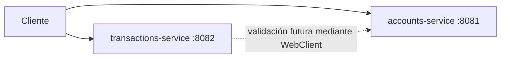

# Laboratorio 1: Diseño de arquitectura base (diagrama + proyecto)

## Información de la práctica

| Propiedad | Valor |
| --- | --- |
| Duración | 90 minutos |
| Proyecto de partida | `starter/` |
| Servicios | `accounts-service`, `transactions-service` |
| Puertos | 8081 y 8082 |
| Resultado observable | Diagrama y dos servicios WebFlux compilables con endpoints reactivos de estado |

## Objetivo

Definir límites y responsabilidades para cuentas y transacciones, representar sus relaciones en un diagrama y comprobar una estructura inicial de dos microservicios Spring WebFlux. El laboratorio establece la base que evolucionará en los capítulos siguientes; no implementa todavía persistencia, JWT, observabilidad ni resiliencia.

## Objetivos de aprendizaje

Al finalizar podrás:

- delimitar dos bounded contexts a partir de capacidades del negocio;
- asignar responsabilidades y datos sin crear acoplamiento por base de datos;
- distinguir comunicación request/response, ejecución no bloqueante y comunicación desacoplada;
- evaluar qué aporta un API Gateway sin seleccionar una implementación por inferencia;
- reconocer una estructura multi-módulo Maven con dos servicios WebFlux;
- externalizar valores mediante YAML, perfiles y variables de entorno;
- compilar y comprobar resultados observables del proyecto base.

## Criterios de éxito

- El diagrama diferencia servicios, responsabilidades y relaciones.
- Cada dato tiene un único servicio propietario.
- Las decisiones confirmadas se distinguen de las decisiones pendientes.
- El proyecto contiene exclusivamente el starter WebFlux necesario para esta práctica.
- Ambos módulos compilan y sus endpoints responden con `Mono`.
- No se utiliza `block()`, `subscribe()` manual, Spring MVC ni APIs Servlet.
- El tiempo total de trabajo no supera 90 minutos.

## Prerrequisitos

- JDK 17 o posterior compatible con la versión del proyecto.
- Maven 3.6.3 o posterior.
- Editor de texto o IDE de elección.
- Herramienta de diagramación de elección; también se acepta Mermaid en Markdown.

```bash
java -version
mvn -version
```

## Arquitectura inicial



El acceso directo mostrado es deliberado: el contrato exige analizar el patrón API Gateway, pero no fija una implementación. La decisión de incorporar un gateway se validará posteriormente sin convertir Spring Cloud Gateway en requisito automático.

### Vocabulario de trabajo

| Concepto | Significado en esta práctica |
| --- | --- |
| Bounded context | Límite dentro del cual un modelo y sus términos tienen un significado consistente. |
| Propietario del dato | Servicio autorizado para cambiar el estado de una entidad de su dominio. |
| Request/response | Interacción en la que el consumidor espera una respuesta del proveedor. |
| No bloqueante | El hilo no queda retenido mientras espera entrada/salida. |
| Desacoplado en el tiempo | Productor y consumidor no necesitan estar disponibles simultáneamente. |
| Patrón de borde | Componente que concentra capacidades transversales en la entrada de un sistema. |

> **Importante:** usar WebFlux o WebClient no convierte automáticamente una llamada HTTP request/response en mensajería asíncrona. Puede ser no bloqueante y continuar acoplada temporalmente.

## Paso 1 — Delimitar los servicios

Tiempo sugerido: **12 minutos**.

Completa esta matriz antes de modificar el diagrama:

| Servicio | Responsabilidad | Datos propios futuros | Fuera de su alcance |
| --- | --- | --- | --- |
| Cuentas | Crear y consultar cuentas; exponer el estado de una cuenta | Cuenta, titular, saldo | Registrar movimientos y autenticar usuarios |
| Transacciones | Registrar y consultar movimientos; coordinar una validación de cuenta | Transacción, tipo, importe | Administrar cuentas y credenciales |

Añade a `architecture.md` las siguientes secciones.

### Reglas iniciales del dominio

Propón al menos dos reglas por servicio. Puedes comenzar con estas:

| Servicio | Regla o invariante | Razón |
| --- | --- | --- |
| Cuentas | Una cuenta debe tener un identificador único. | Evita ambigüedad entre servicios. |
| Cuentas | Solo Cuentas modifica el estado de una cuenta. | Mantiene la propiedad del dato. |
| Transacciones | El importe debe ser mayor que cero. | Protege la consistencia del movimiento. |
| Transacciones | Una transacción referencia una cuenta, pero no modifica directamente sus tablas. | Evita base de datos compartida. |

### Preguntas de frontera

Responde brevemente:

1. ¿Quién determina si una cuenta existe?
2. ¿Quién registra el historial de movimientos?
3. ¿Dónde debería vivir una regla que impide operar sobre una cuenta cerrada?
4. ¿Qué ocurriría si Transacciones leyera directamente las tablas de Cuentas?

Comprobación:

- cada responsabilidad pertenece a un solo servicio;
- ningún servicio accede directamente a los datos del otro;
- las reglas se expresan en lenguaje de negocio, no en nombres de frameworks;
- seguridad, métricas y despliegue no se confunden con bounded contexts del dominio.

## Paso 2 — Crear el diagrama de arquitectura

Tiempo sugerido: **18 minutos**.

1. Copia el diagrama Mermaid anterior a `architecture.md` o recréalo en una herramienta editable.
2. Añade los límites visuales de ambos servicios.
3. Etiqueta la relación futura `transactions-service → accounts-service` como request/response mediante WebClient.
4. Añade una nota: WebClient permite una implementación no bloqueante, pero la interacción HTTP entre servicios sigue siendo síncrona desde la perspectiva arquitectónica porque existe una respuesta acoplada en el tiempo.
5. Representa un gateway como componente candidato y anota qué problema resolvería. No elijas producto todavía.

Usa dos estilos de conexión:

- línea continua: llamada HTTP request/response confirmada o prevista;
- línea punteada: relación futura o decisión todavía no implementada.

Incluye una leyenda y esta tabla debajo del diagrama:

| Relación | Estilo | Estado | Riesgo principal |
| --- | --- | --- | --- |
| Cliente → Cuentas | HTTP request/response | Confirmada en el starter | Dependencia de disponibilidad |
| Cliente → Transacciones | HTTP request/response | Confirmada en el starter | Dependencia de disponibilidad |
| Transacciones → Cuentas | WebClient futuro | Pendiente para Lab 2 | Timeout y fallo parcial |
| Cliente → Gateway → servicios | Patrón de borde | Decisión pendiente | Punto de fallo y exceso de responsabilidades |

### Mini revisión arquitectónica

Intercambia el diagrama con otra persona y revisa:

- ¿se entiende quién es propietario de cada dato?;
- ¿hay una dependencia circular?;
- ¿el gateway contiene lógica de negocio?;
- ¿se afirma que “reactivo” equivale a “asíncrono” sin contexto?;
- ¿los componentes pendientes se distinguen de los implementados?

Comprobación: el diagrama distingue límites de dominio, relaciones y decisiones confirmadas frente a decisiones pendientes.

## Paso 3 — Evaluar el patrón API Gateway

Tiempo sugerido: **10 minutos**.

El temario exige estudiar API Gateway y patrones de borde, pero no obliga a utilizar Spring Cloud Gateway. Completa esta matriz de decisión:

| Necesidad | ¿Aplica al caso? | ¿Gateway puede ayudar? | Riesgo de centralizarla |
| --- | --- | --- | --- |
| Punto de entrada uniforme |  |  |  |
| Enrutamiento por rutas |  |  |  |
| Autenticación en el borde |  |  |  |
| Correlación de solicitudes |  |  |  |
| Transformación de contratos |  |  |  |
| Reglas de negocio de cuentas | No | No | Acoplamiento y gateway monolítico |

Registra una decisión corta con este formato:

```markdown
### ADR-001: Patrón de borde

- Estado: propuesta
- Contexto: existen dos APIs y podrían incorporarse capacidades transversales.
- Decisión: evaluar un API Gateway; la implementación concreta queda pendiente.
- Consecuencias positivas: entrada uniforme y políticas transversales consistentes.
- Riesgos: latencia adicional, punto de fallo y concentración indebida de lógica.
```

Comprobación: la decisión habla del patrón y sus consecuencias, sin convertir un producto concreto en requisito.

## Paso 4 — Inspeccionar el proyecto de partida

Tiempo sugerido: **10 minutos**.

Desde `Capitulo01/starter` ejecuta:

```bash
mvn validate
```

Revisa esta estructura:

```text
starter/
├── pom.xml
├── accounts-service/
│   ├── pom.xml
│   └── src/
└── transactions-service/
    ├── pom.xml
    └── src/
```

Identifica:

- el `pom.xml` padre y la lista de módulos;
- Spring Boot 3.x y Java 17 como baseline materializado;
- la dependencia `spring-boot-starter-webflux`;
- la ausencia de `spring-boot-starter-web`;
- un puerto diferente por servicio;
- la configuración común y la específica del perfil `dev`.

Completa en `architecture.md`:

| Decisión | Evidencia en el starter | Consecuencia |
| --- | --- | --- |
| Build multi-módulo |  |  |
| Un proceso por servicio |  |  |
| WebFlux sin MVC |  |  |
| Puerto por servicio |  |  |
| Perfil `dev` |  |  |

Comprobación: `mvn validate` debe finalizar con `BUILD SUCCESS` para los tres proyectos del reactor Maven.

## Paso 5 — Revisar los endpoints reactivos

Tiempo sugerido: **10 minutos**.

Localiza los controladores. Cada endpoint devuelve `Mono<ServiceStatus>` y no contiene `block()`, `subscribe()` manual ni APIs Servlet.

Sigue la señal del endpoint:

```text
solicitud HTTP
    → controlador WebFlux
    → Mono<ServiceStatus>
    → serialización JSON
    → respuesta HTTP
```

Clasifica cada afirmación:

| Afirmación | Correcta | Justificación |
| --- | --- | --- |
| `Mono<T>` puede emitir como máximo un valor. |  |  |
| Devolver `Mono` garantiza que toda dependencia futura sea no bloqueante. |  |  |
| Llamar `block()` dentro del controlador conserva el modelo reactivo. |  |  |
| WebClient puede componer una llamada sin bloquear el hilo. |  |  |
| Dos servicios WebFlux quedan desacoplados automáticamente. |  |  |

Responde en `architecture.md`:

1. ¿Por qué `Mono<ServiceStatus>` representa cero o un resultado?
2. ¿Qué diferencia existe entre código no bloqueante y comunicación desacoplada?
3. ¿Qué responsabilidad futura requerirá WebClient?

No agregues persistencia, JWT, métricas o retry en este laboratorio.

## Paso 6 — Configurar un ambiente

Tiempo sugerido: **10 minutos**.

```bash
mvn -pl accounts-service spring-boot:run -Dspring-boot.run.profiles=dev
```

En otra terminal:

```bash
curl http://localhost:8081/accounts/status
```

Comprobación: la respuesta incluye `"environment":"dev"`. Detén el servicio antes de continuar.

Spring Boot permite externalizar configuración sin Config Server. Prueba también una variable de entorno.

PowerShell:

```powershell
$env:COURSE_ENVIRONMENT = "local"
mvn -pl accounts-service spring-boot:run
```

Bash:

```bash
COURSE_ENVIRONMENT=local mvn -pl accounts-service spring-boot:run
```

Para admitir la variable, cambia en `application.yml`:

```yaml
course:
  environment: ${COURSE_ENVIRONMENT:default}
```

Comprueba que la respuesta ahora contiene `"environment":"local"`. Después elimina la variable de la sesión o abre una terminal nueva.

Registra el orden observado:

```text
valor por defecto → archivo del perfil → variable de entorno
```

No añadas credenciales ni secretos reales al repositorio.

## Paso 7 — Compilar y validar

Tiempo sugerido: **15 minutos**.

```bash
mvn clean verify
```

Arranca cada servicio en una terminal distinta:

```bash
mvn -pl accounts-service spring-boot:run
mvn -pl transactions-service spring-boot:run
```

Valida:

```bash
curl http://localhost:8081/accounts/status
curl http://localhost:8082/transactions/status
```

Resultado esperado:

```json
{"service":"accounts-service","status":"UP","environment":"default"}
{"service":"transactions-service","status":"UP","environment":"default"}
```

### Validación negativa

Ejecuta una ruta inexistente:

```bash
curl -i http://localhost:8081/accounts/missing
```

Resultado esperado: HTTP `404`. Este resultado confirma que solo se expone el contrato implementado; no es un fallo del laboratorio.

### Revisión estática

Busca en el starter:

```bash
rg "block\(|subscribe\(|javax.servlet|jakarta.servlet" .
rg "<artifactId>spring-boot-starter-web</artifactId>" .
```

Resultado esperado: ninguna coincidencia. Si no tienes `rg`, usa la búsqueda global del IDE.

## Cierre

Tiempo sugerido: **5 minutos**.

Entrega:

- diagrama editable con leyenda;
- matriz de responsabilidades y reglas;
- ADR sobre el patrón de borde;
- tabla de evidencias del starter;
- salida de `mvn clean verify`;
- respuestas HTTP positivas, validación 404 y prueba de configuración.

### Lista de comprobación

- [ ] Cuentas y Transacciones tienen límites comprensibles.
- [ ] No existe una base de datos compartida en el diseño.
- [ ] Request/response no se presenta como mensajería asíncrona.
- [ ] El gateway es una decisión evaluada, no una tecnología impuesta.
- [ ] La configuración cambia sin recompilar el código.
- [ ] Los endpoints devuelven tipos Reactor.
- [ ] No hay llamadas bloqueantes incorporadas.
- [ ] La evidencia entregada corresponde a resultados observados.

## Solución rápida de problemas

- Si Maven no reconoce el JDK, confirma que `java -version` y `mvn -version` muestran la misma instalación.
- Si un puerto está ocupado, detén la instancia anterior; no cambies los puertos sin actualizar el diagrama.
- Si falla la descarga de dependencias, registra el error de red por separado; no sustituyas WebFlux por Spring MVC.
- Si el perfil no se activa, revisa el argumento `-Dspring-boot.run.profiles=dev` y confirma el log de arranque.
- Si una variable no se refleja, confirma su nombre exacto y reinicia el proceso; las variables se leen al arrancar.
- Si aparece un `404` en `/accounts/status`, confirma que arrancaste `accounts-service` y no el otro módulo.
- Si el build falla en un módulo, ejecuta `mvn -pl <modulo> test` y revisa primero la causa original.

## Conceptos clave

- **Límite antes que tecnología:** el servicio nace de una responsabilidad de negocio, no de una dependencia Maven.
- **Propiedad del dato:** cada servicio controla sus cambios y expone un contrato para otros consumidores.
- **No bloqueante no significa desacoplado:** WebFlux optimiza el uso de recursos, pero una llamada HTTP puede seguir acoplada en disponibilidad y tiempo.
- **Gateway como patrón:** debe resolver necesidades de borde y evitar reglas de negocio.
- **Configuración externalizada:** perfiles y variables cubren escenarios básicos sin introducir infraestructura adicional.
- **Evolución incremental:** el starter establece límites; los siguientes laboratorios incorporan comunicación, seguridad, observabilidad y resiliencia.

## Preguntas de reflexión

1. ¿Qué cambio del dominio obligaría a reconsiderar los límites actuales?
2. ¿Cuándo sería preferible comunicación por eventos frente a request/response?
3. ¿Qué política colocarías en un gateway y cuál mantendrías dentro del servicio?
4. ¿Qué configuración puede versionarse y cuál debe tratarse como secreto?
5. ¿Qué evidencia adicional necesitarías antes de declarar el sistema listo para producción?

## Nota para el instructor

El foco es justificar límites y decisiones, no producir infraestructura. El gateway permanece como patrón candidato. WebClient, persistencia, JWT, Actuator y resiliencia se implementan en laboratorios posteriores.

## Fuentes oficiales

- [Spring WebFlux](https://docs.spring.io/spring-framework/reference/web/webflux.html)
- [Spring Boot 3.4 — requisitos del sistema](https://docs.spring.io/spring-boot/3.4/system-requirements.html)
