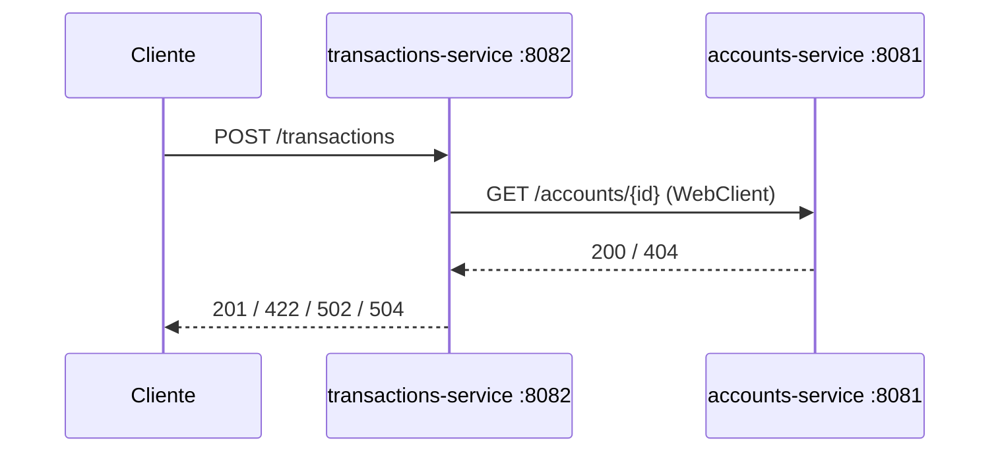

# Laboratorio 2: Construcción de dos microservicios reactivos

## Información de la práctica

| Propiedad | Valor |
| --- | --- |
| Duración de trabajo | 95 minutos |
| Proyecto de partida | `starter/`, evolución del Laboratorio 1 |
| Servicios | `accounts-service` (8081) y `transactions-service` (8082) |
| Stack | Spring Boot 3.4.13, Java 17, WebFlux, Reactor y WebClient |
| Resultado observable | Transacción validada mediante una llamada WebClient no bloqueante |

> **Advertencia contractual:** el capítulo 2 declara 180 minutos, pero sus bloques visibles suman 195 minutos y existe un renglón provisional adicional de 80 minutos. Este laboratorio conserva los 95 minutos asociados a la construcción de dos microservicios; no interpreta ni modifica el renglón provisional.

## Objetivo

Evolucionar los dos servicios del Laboratorio 1 para implementar comunicación HTTP no bloqueante con WebClient, composición reactiva, manejo explícito de errores y timeout, y logging básico con correlación. Persistencia, seguridad y observabilidad quedan fuera de esta práctica.

## Criterios de éxito

- `accounts-service` responde una cuenta existente y devuelve 404 para una inexistente.
- `transactions-service` valida la cuenta mediante WebClient sin `block()` ni `subscribe()` manual.
- Una transacción válida devuelve 201; una cuenta inexistente devuelve 422.
- Si Cuentas no está disponible devuelve 502; si supera el timeout devuelve 504.
- El log de éxito incluye `event`, `traceId`, `accountId` y `durationMs`.
- El reactor Maven compila y todas las pruebas pasan.

## Arquitectura



La interacción sigue siendo request/response y está acoplada a la disponibilidad de Cuentas. WebClient evita bloquear el hilo mientras espera; no convierte HTTP en mensajería asíncrona.

## Paso 1 — Revisar el proyecto de partida (10 min)

Desde `Capitulo02/starter` ejecuta `mvn validate`. Comprueba los dos módulos, Spring Boot 3.4.13, Java 17 y `spring-boot-starter-webflux`. No debe existir `spring-boot-starter-web`.

## Paso 2 — Examinar el contrato de Cuentas (12 min)

Abre `AccountController.java`. `GET /accounts/{id}` usa `Mono.justOrEmpty` y `switchIfEmpty` para convertir la ausencia en HTTP 404. El almacén en memoria es deliberadamente mínimo: el foco es la comunicación.

```powershell
curl.exe http://localhost:8081/accounts/1
curl.exe -i http://localhost:8081/accounts/999
```

## Paso 3 — Seguir la llamada WebClient (15 min)

En `AccountsClient.java` identifica:

```text
GET /accounts/{id} → retrieve() → bodyToMono(AccountView.class) → timeout(configurable)
```

La URL y el timeout se externalizan con `ACCOUNTS_BASE_URL` y `ACCOUNTS_TIMEOUT`. No agregues `block()`; el servidor suscribe la cadena al procesar la solicitud.

## Paso 4 — Analizar la composición reactiva (15 min)

En `TransactionController.java`, sigue esta secuencia:

```text
cuenta remota → filter → switchIfEmpty → map(201) → doOnSuccess(logging) → onErrorResume
```

| Situación | Respuesta | Señal |
| --- | --- | --- |
| Cuenta válida | 201 `ACCEPTED` | valor |
| Cuenta inexistente | 422 `ACCOUNT_NOT_FOUND` | error HTTP remoto |
| Dependencia lenta | 504 `TIMEOUT` | timeout |
| Dependencia caída | 502 `DEPENDENCY_ERROR` | error de conexión |

## Paso 5 — Compilar y ejecutar pruebas (15 min)

```powershell
mvn verify
```

Las pruebas validan los endpoints de estado, la cuenta existente y el 404. Resultado esperado: `BUILD SUCCESS` sin fallos.

## Paso 6 — Validar 201 y 422 (15 min)

Arranca los servicios en terminales separadas:

```powershell
mvn -pl accounts-service spring-boot:run
mvn -pl transactions-service spring-boot:run
```

```powershell
curl.exe -i -X POST http://localhost:8082/transactions -H "Content-Type: application/json" -d '{"accountId":1,"amount":250.00}'
curl.exe -i -X POST http://localhost:8082/transactions -H "Content-Type: application/json" -d '{"accountId":999,"amount":250.00}'
```

Comprueba 201 y 422 y localiza en el log `traceId` y `durationMs`.

## Paso 7 — Provocar fallo de dependencia (8 min)

Detén `accounts-service` y repite la solicitud. Espera HTTP 502 con `DEPENDENCY_ERROR`. Para observar 504, el instructor puede apuntar `ACCOUNTS_BASE_URL` a un stub lento. No uses `Thread.sleep` dentro de código reactivo.

## Cierre (5 min)

Entrega el resultado de `mvn verify`, respuestas 201/422/502, ubicación del timeout, una línea de log correlacionada y una explicación de por qué WebClient es no bloqueante pero request/response continúa acoplado temporalmente.

## Solución rápida de problemas

- Si 8081 u 8082 están ocupados, detén la instancia previa.
- Si aparece 502 en el caso exitoso, inicia primero `accounts-service` y verifica `/accounts/1`.
- Si Maven no puede limpiar `target` en una carpeta sincronizada, ejecuta `verify` desde una copia limpia.
- No incorpores Docker, PostgreSQL, JWT, Actuator o retry: pertenecen a decisiones o capítulos posteriores.

## Fuentes oficiales

- [Spring WebClient](https://docs.spring.io/spring-framework/reference/web/webflux-webclient.html)
- [Recuperación de respuestas](https://docs.spring.io/spring-framework/reference/web/webflux-webclient/client-retrieve.html)
- [Manejo de errores en Reactor](https://projectreactor.io/docs/core/release/reference/coreFeatures/error-handling.html)
- [Contexto reactivo](https://projectreactor.io/docs/core/release/reference/advancedFeatures/context.html)
- [Logging en Spring Boot](https://docs.spring.io/spring-boot/reference/features/logging.html)
