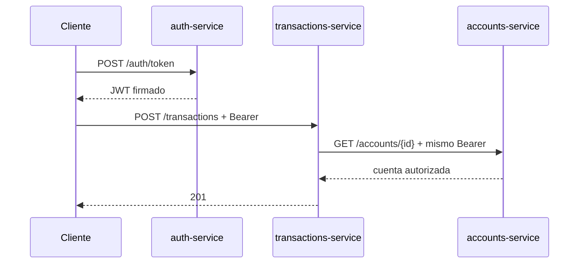

# Laboratorio 3: Integración de JWT y protección de APIs

## Información

| Propiedad | Valor |
| --- | --- |
| Duración | 105 minutos |
| Starter | Evolución ejecutable del Laboratorio 2 |
| Servicios | auth-service :8083, accounts-service :8081, transactions-service :8082 |
| Seguridad | Spring Security WebFlux, OAuth2 Resource Server y JWT HS256 |

## Objetivo

Emitir tokens JWT de laboratorio, validar su firma y expiración en cada microservicio, autorizar por rol, observar 401/403 y propagar el bearer token desde Transacciones hacia Cuentas sin usar APIs Servlet ni llamadas bloqueantes.

> La clave predeterminada es exclusivamente didáctica. Para cualquier ambiente compartido define `JWT_SECRET` con un valor aleatorio de al menos 32 bytes y no lo versiones.

## Criterios de éxito

- Token con tres segmentos y claims `iss`, `sub`, `iat`, `exp` y `scope`.
- Sin token: 401; rol insuficiente: 403.
- USER consulta cuentas; ADMIN accede a `/accounts/admin/audit`.
- Una transacción protegida propaga `Authorization: Bearer …` a Cuentas.
- Build y pruebas pasan sin `block()`, `subscribe()` manual ni APIs Servlet.

## Flujo



## Paso 1 — Inspeccionar el baseline (10 min)

Ejecuta `mvn validate` en `Capitulo03/starter`. Confirma Spring Boot 3.4.13, Java 17 y los tres módulos. No se requieren Gateway, Docker, base de datos ni servicio externo de identidad.

## Paso 2 — Revisar emisión y claims (15 min)

Abre `TokenController.java`. Identifica HS256, issuer, subject, expiración y `scope`. Genera tokens didácticos:

```powershell
curl.exe -X POST http://localhost:8083/auth/token -H "Content-Type: application/json" -d '{"username":"student","role":"USER"}'
curl.exe -X POST http://localhost:8083/auth/token -H "Content-Type: application/json" -d '{"username":"instructor","role":"ADMIN"}'
```

No registres el token completo en logs ni lo envíes como query parameter.

## Paso 3 — Validar JWT en WebFlux (15 min)

Revisa `SecurityConfig.java` en ambos servicios:

- `SecurityWebFilterChain`, no `HttpSecurity` Servlet;
- `NimbusReactiveJwtDecoder` con HS256;
- endpoint de estado público y recursos de negocio autenticados;
- CSRF deshabilitado únicamente porque estas APIs son stateless con bearer token.

## Paso 4 — Probar autenticación 401 (12 min)

Sin header:

```powershell
curl.exe -i http://localhost:8081/accounts/1
```

Espera 401. Repite con `Authorization: Bearer <TOKEN_USER>` y espera 200. Un JWT no solo debe decodificarse: debe verificarse firma y expiración.

## Paso 5 — Probar autorización 403 (13 min)

```powershell
curl.exe -i http://localhost:8081/accounts/admin/audit -H "Authorization: Bearer <TOKEN_USER>"
curl.exe -i http://localhost:8081/accounts/admin/audit -H "Authorization: Bearer <TOKEN_ADMIN>"
```

Espera 403 y 200 respectivamente. 401 significa ausencia o invalidez de autenticación; 403 significa identidad válida sin autoridad suficiente.

## Paso 6 — Propagar el bearer token (15 min)

En `TransactionController` observa la recepción del header y en `AccountsClient` su reenvío. Ejecuta:

```powershell
curl.exe -i -X POST http://localhost:8082/transactions -H "Content-Type: application/json" -H "Authorization: Bearer <TOKEN_USER>" -d '{"accountId":1,"amount":250.00}'
```

Espera 201. El servicio receptor vuelve a validar el JWT; no confía en headers `X-User-*` aportados por el cliente.

## Paso 7 — Build, pruebas y revisión negativa (15 min)

```powershell
mvn verify
rg "block\(|subscribe\(|javax.servlet|jakarta.servlet" .
```

Valida además token ausente, token alterado y rol insuficiente. El resultado esperado es 401/401/403.

## Cierre (10 min)

Entrega evidencia de JWT emitido sin revelar el valor completo, respuestas 401/403/200, transacción 201 con propagación y salida de Maven. Explica por qué autenticación y autorización son decisiones distintas.

## Solución rápida

- 401 con token válido: confirma que los tres procesos reciben el mismo `JWT_SECRET`.
- 403 para ADMIN: revisa que el claim sea `scope=ROLE_ADMIN` y la regla `SCOPE_ROLE_ADMIN`.
- 502 en transacción: inicia Cuentas y verifica que el bearer se reenvía.
- Nunca soluciones una prueba desactivando seguridad o confiando en headers de usuario enviados directamente.

## Fuentes oficiales

- [Spring Security WebFlux](https://docs.spring.io/spring-security/reference/reactive/configuration/webflux.html)
- [Resource Server JWT](https://docs.spring.io/spring-security/reference/reactive/oauth2/resource-server/jwt.html)
- [Autorización reactiva](https://docs.spring.io/spring-security/reference/reactive/authorization/method.html)
- [Bearer tokens](https://docs.spring.io/spring-security/reference/reactive/oauth2/resource-server/bearer-tokens.html)
- [RFC 7519](https://www.rfc-editor.org/rfc/rfc7519)
