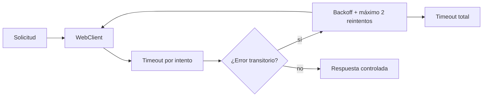

# Laboratorio 4: Métricas y pruebas de resiliencia

## Información

| Propiedad | Valor |
| --- | --- |
| Duración | 80 minutos |
| Starter | Evolución ejecutable del Laboratorio 3 |
| Objetivo observable | Health/probes, métrica de negocio, retry selectivo y timeouts |
| Stack | Spring Boot 3.4.13, Actuator, Micrometer y Reactor |

Prometheus se estudia como modelo de scraping y formato conceptual. Este laboratorio no exige Docker, Prometheus Server, Grafana, circuit breaker ni Resilience4j.

## Criterios de éxito

- `/actuator/health`, `/liveness` y `/readiness` responden 200.
- La métrica `course.transactions` registra resultados.
- La llamada a Cuentas aplica timeout por intento, retry limitado y presupuesto total.
- No se reintenta el 404 de negocio.
- Al caer Cuentas, Transacciones termina con 502 sin retry infinito.
- Seguridad JWT de Lab 3 permanece activa.

## Flujo de resiliencia



## Paso 1 — Incorporar Actuator (10 min)

Revisa los POM y `application.yml`. Solo se exponen `health` y `metrics`; los detalles sensibles no quedan públicos. Ejecuta `mvn validate`.

## Paso 2 — Consultar health y probes (12 min)

```powershell
curl.exe http://localhost:8081/actuator/health
curl.exe http://localhost:8081/actuator/health/liveness
curl.exe http://localhost:8081/actuator/health/readiness
```

Liveness indica si el proceso debe reiniciarse; readiness indica si debe recibir tráfico. No son exclusivas de Kubernetes.

## Paso 3 — Registrar una métrica de negocio (12 min)

En `TransactionController`, identifica los contadores `course.transactions` con tags `accepted` y `failed`. Genera una transacción y consulta con JWT:

```powershell
curl.exe http://localhost:8082/actuator/metrics/course.transactions -H "Authorization: Bearer <TOKEN_USER>"
```

Evita tags con `traceId`, cuenta o usuario: producirían cardinalidad no acotada.

## Paso 4 — Analizar timeout y retry (15 min)

En `AccountsClient` identifica:

```text
timeout por intento → retryWhen(backoff, máximo 2) → timeout total
```

Solo se reintentan errores de conexión, timeout y respuestas 5xx. El 404 no se reintenta. Una operación de escritura no idempotente requeriría una decisión adicional antes de habilitar retry.

## Paso 5 — Validar éxito y caída parcial (15 min)

Con los tres servicios activos, crea una transacción protegida y espera 201. Después detén Cuentas y repite; espera 502 `DEPENDENCY_ERROR`. Confirma que la respuesta termina dentro del presupuesto y que no existe retry infinito.

## Paso 6 — Build y revisión estática (11 min)

```powershell
mvn verify
rg "block\(|subscribe\(|javax.servlet|jakarta.servlet" .
```

Comprueba además que JWT, 401 y 403 del laboratorio anterior continúan operativos.

## Cierre (5 min)

Entrega respuestas de health/probes, métrica después de una operación, evidencia del 201 y 502, y explicación de la política de retry. Total: 80 minutos.

## Prometheus conceptual

Un registry Prometheus podría publicar una representación scrapeable y un servidor Prometheus consultarla periódicamente. Esa infraestructura no es necesaria para demostrar Actuator, Micrometer, health o resiliencia en esta práctica.

## Solución rápida

- Health 401: confirma que `/actuator/health/**` está permitido explícitamente.
- Métrica 404: genera primero una transacción o revisa el nombre del meter.
- Fallo demasiado lento: revisa timeout por intento, backoff y presupuesto total.
- Nunca “corrijas” un timeout usando `block()` o aumentando el número de reintentos sin límite.

## Fuentes oficiales

- [Actuator endpoints](https://docs.spring.io/spring-boot/reference/actuator/endpoints.html)
- [Métricas de Spring Boot](https://docs.spring.io/spring-boot/reference/actuator/metrics.html)
- [Prometheus: visión general](https://prometheus.io/docs/introduction/overview/)
- [Retry en Reactor](https://projectreactor.io/docs/core/release/reference/coreFeatures/error-handling.html#_retrying)
- [Kubernetes probes](https://docs.spring.io/spring-boot/reference/actuator/endpoints.html#actuator.endpoints.kubernetes-probes)
