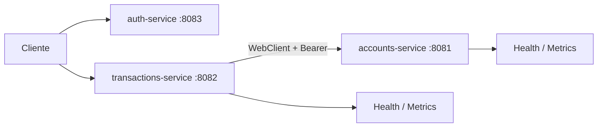

# Laboratorio 5: Proyecto integrador — demo funcional completa

## Información

| Propiedad | Valor |
| --- | --- |
| Duración | 30 minutos |
| Punto de partida | Starter acumulado y validado del Laboratorio 4 |
| Dominio | Cuentas y transacciones |
| Resultado | Demo end-to-end con seguridad, métricas y fallo parcial |

Este laboratorio no reconstruye el sistema. Tampoco añade Docker, PostgreSQL, Gateway, Prometheus Server, Grafana, circuit breaker ni nuevas dependencias.

## Criterios de éxito

- Reactor Maven y pruebas en `PASS`.
- Tres servicios arrancan y health responde 200.
- Token USER válido; solicitud sin token devuelve 401.
- Cuenta protegida responde 200.
- Transacción propaga el bearer token y devuelve 201.
- `course.transactions` refleja la operación.
- Con Cuentas detenido, Transacciones devuelve 502 después del retry limitado.

## Arquitectura final demostrada



## Paso 1 — Build y arranque (8 min)

Desde `Capitulo05/starter`:

```powershell
mvn verify
```

Arranca `auth-service`, `accounts-service` y `transactions-service` desde terminales separadas. Consulta `/actuator/health` en 8081 y 8082.

## Paso 2 — Seguridad y dominio (7 min)

Solicita un token USER en `POST http://localhost:8083/auth/token`. Comprueba primero que `GET /accounts/1` sin token devuelve 401 y después que con bearer devuelve 200.

Esta secuencia demuestra autenticación, validación de firma y acceso al bounded context de Cuentas.

## Paso 3 — Transacción end-to-end (7 min)

```powershell
curl.exe -i -X POST http://localhost:8082/transactions -H "Content-Type: application/json" -H "Authorization: Bearer <TOKEN_USER>" -d '{"accountId":1,"amount":250.00}'
```

Espera HTTP 201 `ACCEPTED`. Transacciones reutiliza WebClient, propaga el bearer y Cuentas vuelve a validar el JWT.

## Paso 4 — Observabilidad y fallo parcial (5 min)

Consulta con token:

```powershell
curl.exe http://localhost:8082/actuator/metrics/course.transactions -H "Authorization: Bearer <TOKEN_USER>"
```

Detén Cuentas y repite la transacción. Espera 502 `DEPENDENCY_ERROR`; el retry es limitado y respeta el presupuesto total.

## Cierre (3 min)

Entrega una tabla breve:

| Evidencia | Esperado |
| --- | --- |
| Build | PASS |
| Health | 200 |
| Sin token | 401 |
| Cuenta autorizada | 200 |
| Transacción | 201 |
| Métrica | count ≥ 1 |
| Cuentas caído | 502 |

## Fuentes oficiales

- [Spring WebFlux](https://docs.spring.io/spring-framework/reference/web/webflux.html)
- [WebTestClient](https://docs.spring.io/spring-framework/reference/testing/webtestclient.html)
- [Resource Server JWT](https://docs.spring.io/spring-security/reference/reactive/oauth2/resource-server/jwt.html)
- [Actuator](https://docs.spring.io/spring-boot/reference/actuator/endpoints.html)
- [Micrometer](https://docs.micrometer.io/micrometer/reference/)
